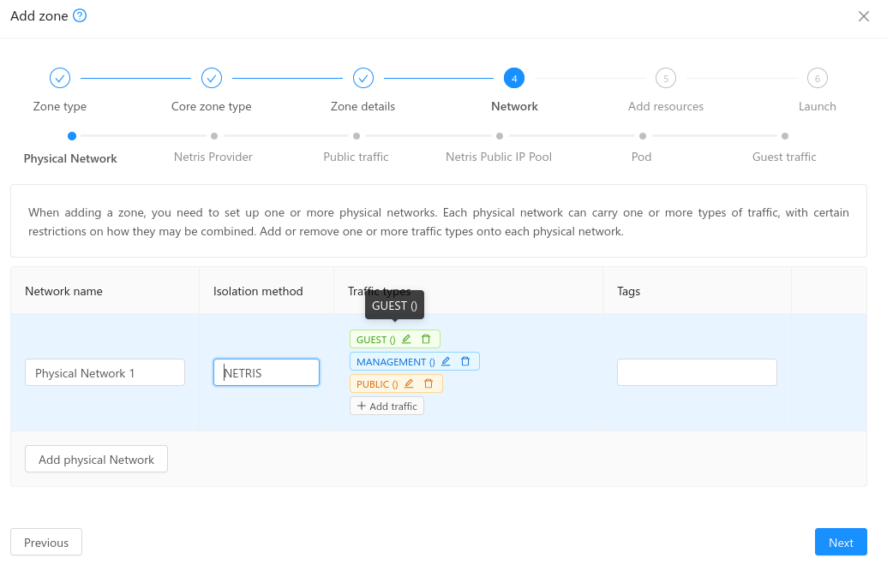

.. Licensed to the Apache Software Foundation (ASF) under one
   or more contributor license agreements.  See the NOTICE file
   distributed with this work for additional information#
   regarding copyright ownership.  The ASF licenses this file
   to you under the Apache License, Version 2.0 (the
   "License"); you may not use this file except in compliance
   with the License.  You may obtain a copy of the License at
   http://www.apache.org/licenses/LICENSE-2.0
   Unless required by applicable law or agreed to in writing,
   software distributed under the License is distributed on an
   "AS IS" BASIS, WITHOUT WARRANTIES OR CONDITIONS OF ANY
   KIND, either express or implied.  See the License for the
   specific language governing permissions and limitations
   under the License.

The Netris Plugin
=================

Introduction
------------

The Netris Plugin introduces Netris as a network service provider in CloudStack to be able to create and manage Virtual Private Clouds (VPCs) in CloudStack, being able to orchestrate the following network functionalities:

- Network segmentation with Netris-VXLAN isolation method
- Routing between "public" IP and network segments with an ACS ROUTED mode offering
- SourceNAT, DNAT, 1:1 NAT between "public" IP and network segments with an ACS NATTED mode offering
- Routing between VPC network segments (tiers in ACS nomenclature)
- Access Lists (ACLs) between VPC tiers and "public" network (TCP, UDP, ICMP) both as global egress rules and "public" IP specific ingress rules.
- ACLs between VPC network tiers (TCP, UDP, ICMP)
- External load balancing – between VPC network tiers and "public" IP
- Internal load balancing – between VPC network tiers
- CloudStack Virtual Router services (DHCP, DNS, UserData, Password Injection, etc…)

Supported Versions
------------------

+--------------+----------------------+----------------+
| Hypervisor   | CloudStack Version   | Netris Version |
+==============+======================+================+
| KVM          | >= 4.20              | 4.4.0          |
+--------------+----------------------+----------------+

Table: Supported Versions

Configuration
-------------

Prerequisites
~~~~~~~~~~~~~

The Netris plugin is enabled by the 'netris.plugin.enable' setting, which is false by default. It enables the Netris Plugin on CloudStack when it is set to true. The global setting is non-dynamic, that is, the management server would need to be restarted after being modified.

Zone creation
~~~~~~~~~~~~~

The CloudStack Zone creation wizard is extended:

- A new isolation method is added for the Core zone, with Advanced networking and KVM hypervisor: NETRIS

- When the NETRIS isolation method is selected, new steps are added to the zone creation wizard:
   - Netris Provider: in this step the administrator must provide:
      - Netris provider URL along with an internal name for reference
      - Netris provider credentials to login into the Netris provider
      - Site name: The Netris Site Name to be linked to
      - Admin Tenant Name: The name of the Admin Tenant on the Netris provider
      - Netris tag: A tag to be used on each Netris VNET creation

      .. image:: ../_static/images/netris-provider-config.png
         :width: 600px
         :align: center

   - Public traffic and Netris IP Pool: The public traffic is split in two sections.
      - Public traffic: The first Public IP range defined on this section will be marked for system VMs (and a tag will be displayed accordingly, with the name 'systemvm'). The next Public IP ranges defined on this section will be available for VR Public IPs.

      .. image:: ../_static/images/netris-sysvm-vr-ip-range.png
         :width: 600px
         :align: center

      - Netris IP Pool: Administrators must provide the Public IP range to be used by VPC operations: Source NAT, Load Balancing, Port Forwarding, Static NAT (this range is marked with the tag 'netris') 

      .. image:: ../_static/images/netris-public-ip-pool.png
         :width: 600px
         :align: center

- When a new zone is being created,  CloudStack will check the Public IP ranges defined and will perform the following actions on Netris:
   - Create an IPAM allocation for the Netris IP Pool range linked to the default VPC.
   - If an existing IPAM allocation contains the Netris IP Pool provided, then the range must be created as a new IPAM subnet as a child entity of the existing allocation on Netris, with purpose: 'common'. The 'common' subnet purpose allows creating 'nat' and 'load-balancer' child subnets.

.. note::
   **Important:**
   Please note CloudStack expects the public IP ranges defined in the same order as the zone wizard creation displays them. The same order must be preserved in case of adding/editing/removing public IP ranges:

   - System VM Public Range
   - VRs Public Range
   - Netris Public Range

The subsequent steps of zone creation remain unchanged and once the zone is successfully created and enabled, the system VMs come up with IPs from the Public IP Range reserved for System VMs (not the Netris public IP range).      

VPC creation on Netris
~~~~~~~~~~~~~~~~~~~~~~

VPC creation on CloudStack performs the following actions on Netris:

- A new VPC is created for the Admin Tenant provided at the zone creation phase, with the name convention: D<domainID>-A<accountID>-Z<zoneID>-V<vpcID>-<vpcName>, where:
   - domainID: Internal database ID of the domain
   - accountID: Internal database ID of the account
   - zoneID: Internal database ID of the VPC
   - vpcName: Name of the VPC

- A new IPAM allocation is created for the VPC Guest CIDR, with the following parameters:
   - Prefix: The VPC CIDR
   - Name: D<domainID>-A<accountID>-Z<zoneID>-V<vpcID>-<vpcCidr>, where:
   - vpcCidr: is the CIDR defined for the VPC
   - VPC: The new VPC created on the step above 

- Source NAT is created for VPC in NAT mode

VPC Tier creation on Netris
~~~~~~~~~~~~~~~~~~~~~~~~~~~

VPC Tier creation on CloudStack performs the following actions on Netris:

- A new IPAM subnet is created for the VPC Tier, with the following parameters:
   - Prefix: The VPC Tier CIDR
   - Name: D<domainID>-A<accountID>-Z<zoneID>-N<networkID>-<vpcTierCidr>, where:
      - networkID: The internal database ID of the network tier
      - vpcTierCidr: is the CIDR defined for the VPC Tier
   - Purpose: 'common'
   - VPC: The VPC created on the step above 

- A new vNet is created, with the following parameters:
   - Name: D<domainID>-A<accountID>-Z<zoneID>-N<networkID>-<vpcTierName>, where:
      - vpcTierName: is the VPC Tier name
   - VPC: The VPC created on the step above
   - VXLAN ID: A random VXLAN from the range provided on the zone creation
   - VLAN ID: Disabled
   - Tags: The tag set on the zone creation
   - IP Gateway: The VPC Tier gateway IP, from the subnet created on the step above.
- ACLs are created on Netris

- The VPC tiers created from the default VPC network offering for Netris – Routed Mode extends the IPAM Subnet creation for the VPC Tier Guest CIDR by setting the parameter:
   - Global Routing = true. This parameter allows advertising the IPs for the VPC tier (required for Routed mode)

.. note::
Important: Please consider at least one running VM per VPC tier to prevent VPC tier state transition to Allocated state    

Supported VPC Services
~~~~~~~~~~~~~~~~~~~~~~

· The following operations are supported for VPCs created from the default **VPC offering for Netris – NAT mode**: 
   - Source NAT:
      - A new IPAM subnet is created for the Source NAT IP of the VPC, under the Netris IP pool IPAM allocation, with the following parameters:
         - **Prefix**: <SOURCE_NAT_IP>/32, where SOURCE_NAT_IP is the VPC Source NAT IP
         - **Purpose**: 'nat' 
         - **VPC**: Default VPC
         - **Name**: D<domainID>-A<accountID>-Z<zoneID>-V<vpcID>-<vpcCidr>

      - A new NAT rule is created with the following parameters:
         - **Action**: SNAT
         - **Protocol**: ALL
         - **VPC**: The associated VPC
         - **Name**: D<domainID>-A<accountID>-Z<zoneID>-V<vpcID>-SNAT
         - **Source Address**: The VPC CIDR
         - **Destination Address**: 0.0.0.0/0
         - **SNAT to IP**: true, set to the Source NAT Public IP

   - Port forwarding rules:
      - A new IPAM subnet is created for the Public IP, under the Netris IP Pool IPAM allocation, with the following parameters:
         - **Prefix**: <PUBLIC_IP>/32, where PUBLIC_IP is the selected free public IP
         - **Purpose**: 'nat'
         - **VPC**: Default VPC
         - **Name**: D<domainID>-A<accountID>-Z<zoneID>-V<vpcID>-<vpcCidr>    

      - A new NAT rule is created with the following parameters:
         - **Action**: DNAT
         - **VPC**: The associated VPC
         - **Name**: D<domainID>-A<accountID>-Z<zoneID>-V<vpcID>-DNAT-R<ruleID>, where:
            - **Rule ID**: The internal database ID of the port forwarding rule
         - **Protocol**: The protocol for the port forwarding rule
         - **Source Address**: 0.0.0.0/0
         - **Source Port**: 1-65535
         - **Destination Address**: The port forwarding Public IP
         - **Destination Port**: The port forwarding rule public port
         - **DNAT to IP**: <VM_IP>/32, where VM_IP: is the VM guest IP
         - **DNAT to port**: The port forwarding rule private port 

   - Static NAT:
      - A new IPAM subnet is created for the Public IP, under the Netris IP Pool IPAM allocation, with the following parameters:
         - **Prefix**: <PUBLIC_IP>/32, where PUBLIC_IP is the selected free public IP
         - **Purpose**: 'nat'
         - **VPC**: Default VPC
         - **Name**: D<domainID>-A<accountID>-Z<zoneID>-V<vpcID>-<vpcCidr> 

      - A new NAT rule is created with the following parameters:
         - **Action**: DNAT
         - **VPC**: The associated VPC
         - **Name**: D<domainID>-A<accountID>-Z<zoneID>-V<vpcID>-STATICNAT:
         - **Protocol**: ALL
         - **Source Address**: 0.0.0.0/0
         - **Destination Address**: The port forwarding Public IP
         - **DNAT to IP**: <VM_IP>/32, where VM_IP: is the VM guest IP 

   - Load Balancing:
      - A new IPAM subnet is created for the Public IP, under the Netris IP Pool IPAM allocation, with the following parameters:
         - **Prefix**: <PUBLIC_IP>/32, where PUBLIC_IP is the selected free public IP
         - **Purpose**: 'load-balancer'
         - **VPC**: Default VPC
         - **Name**: D<domainID>-A<accountID>-Z<zoneID>-V<vpcID>-<vpcCidr>

      - A new L4 Load Balancer is created with the following parameters:
         - **Action**: DNAT
         - **VPC**: The associated VPC
         - **Name**: D<domainID>-A<accountID>-Z<zoneID>-V<vpcID>-LB<lbID>, where:
            - **lbID**: The internal database ID of the load balancer
         - **Protocol**: The protocol for the load balancer
         - **Frontend Address**: The load balancer Public IP
         - **Frontend Port**: The load balancer public port
         - For each VM added to the load balancer:
            - **Backend address**: The guest VM IP
            - **Backend port**: The load balancer private port

   - ACLs
      - A new ACL rule is created for each CloudStack ACL rule defined on the network tier ACL:
         - **Name**: D<domainID>-A<accountID>-Z<zoneID>-V<vpcID>-N<networkID>-ACL<aclID>, where:
            - **aclID**: The internal database ID of the ACL rule
         - **VPC**: The associated VPC
         - **Protocol**: The selected protocol for the ACL Rule
         - **Action**: 'permit' or 'deny' matching the selected Allow or Deny action on CloudStack
         - If the traffic type is **Ingress**:
            - **Source Address**: The ACL rule CIDR
            - **Source Port**: 1-65535
            - **Destination Address**: The VPC Tier CIDR
            - **Destination Port**: X-Y, where:
               - *X*: The ACL rule start port
               - *Y*: The ACL rule end port
         - If the traffic type is Egress:
            - **Reverse**: true
            - **Source Address**: The VPC Tier CIDR
            - **Source Port**: 1-65535
            - **Destination Address**: The ACL rule CIDR
            - **Destination Port**: X-Y, where:
               - *X*: The ACL rule start port
               - *Y*: The ACL rule end port